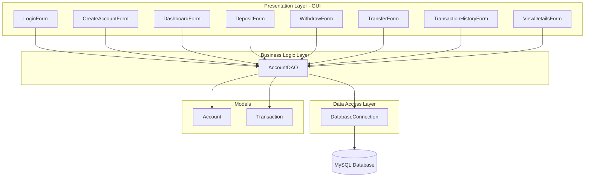
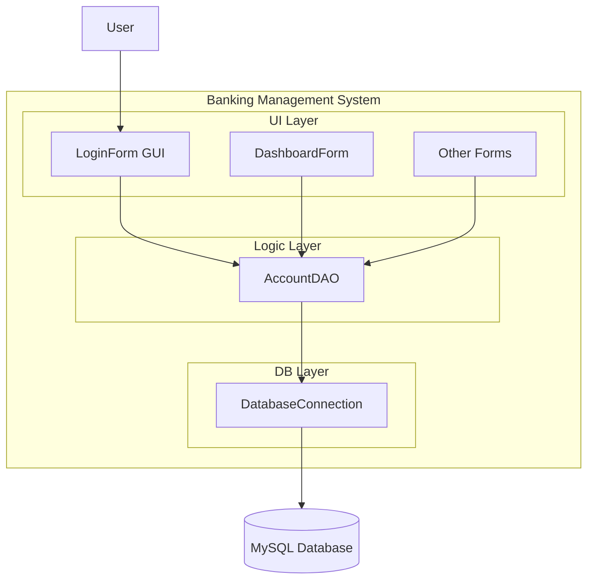
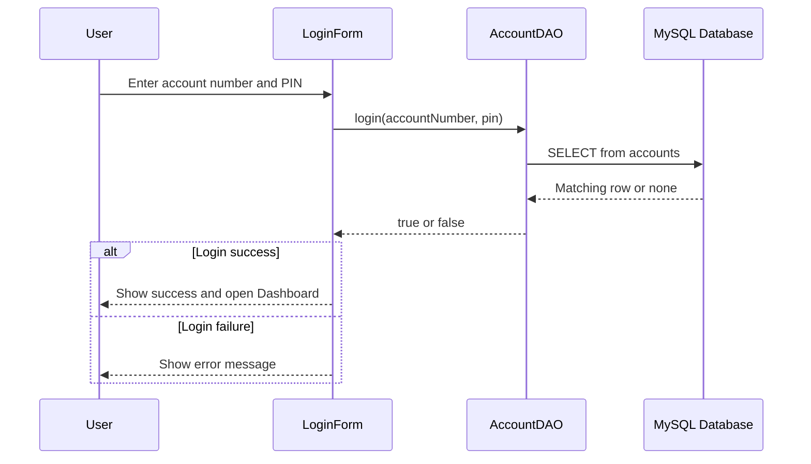
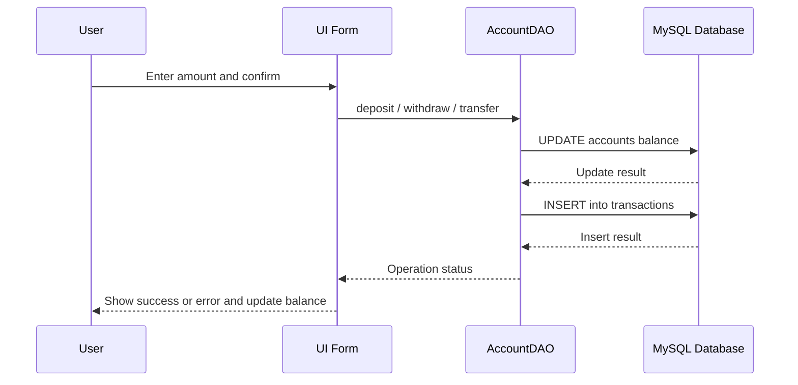
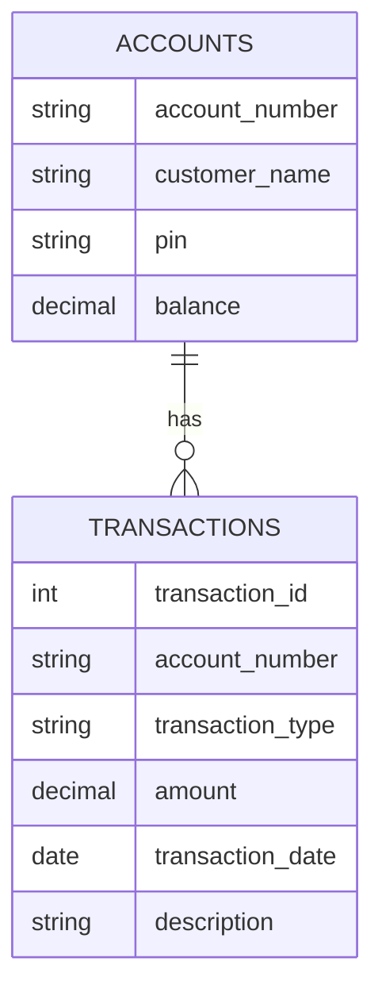

# Banking Management System

## 1. Project Overview

The **Banking Management System** is a Java desktop application built using Java Swing. It allows users to perform basic banking operations through a clean and simple graphical user interface. The system stores all account and transaction data in a MySQL database and uses JDBC for communication.

---

## 2. Features

This project includes the following core features:

- **Account Creation**
  - Create a new bank account with a customer name, PIN, and initial deposit.
- **Secure Login**
  - Login using an account number and 4-digit PIN stored in the database.
- **Deposit Money**
  - Add funds to the logged-in account and update the balance.
- **Withdraw Money**
  - Withdraw money if the account has sufficient balance.
- **Transfer Funds**
  - Transfer funds from one account to another using account numbers.
- **Transaction History**
  - View a list of all previous transactions for an account.
- **View Account Details**
  - See account number, customer name, and current balance.

---

## 3. Technologies Used

The project uses the following technologies:

- **Java** – Core programming language
- **Java Swing** – GUI framework for desktop application
- **MySQL** – Relational database for storing data
- **JDBC** – Java Database Connectivity for database access
- **MySQL Connector/J** – JDBC Driver for MySQL
- **IntelliJ IDEA** – Recommended IDE for development

---

## 4. System Architecture

The Banking Management System follows a simple **layered architecture**. Each layer has a clear responsibility, which makes the code easier to read and understand.

- **Presentation Layer (GUI)**  
  Handles user interaction and screen rendering using Java Swing.

  Files:
  - `LoginForm.java`
  - `CreateAccountForm.java`
  - `DashboardForm.java`
  - `DepositForm.java`
  - `WithdrawForm.java`
  - `TransferForm.java`
  - `TransactionHistoryForm.java`
  - `ViewDetailsForm.java`

- **Business Logic Layer**  
  Contains the application rules for banking operations.

  Files:
  - `AccountDAO.java`

- **Data Access Layer**  
  Manages connection to the MySQL database using JDBC.

  Files:
  - `DatabaseConnection.java`

- **Models**  
  Represent data structures for accounts and transactions.

  Files:
  - `Account.java`
  - `Transaction.java`

- **Entry Point**  
  Starts the application and opens the login screen.

  Files:
  - `Main.java`

### Architecture Diagram



---

## 5. Project Structure

The project is organized into packages by responsibility. This makes it easy to find files and understand their purpose.

```bash
Banking-Management-System
|
└── src
    ├── dao
    │   └── AccountDAO.java
    │
    ├── database
    │   └── DatabaseConnection.java
    │
    ├── models
    │   ├── Account.java
    │   └── Transaction.java
    │
    └── ui
        ├── LoginForm.java
        ├── CreateAccountForm.java
        ├── DashboardForm.java
        ├── DepositForm.java
        ├── WithdrawForm.java
        ├── TransferForm.java
        ├── TransactionHistoryForm.java
        └── ViewDetailsForm.java
|
└── screenshots
    ├── login.png
    ├── create-account.png
    ├── dashboard.png
    ├── deposit.png
    ├── withdraw.png
    ├── transfer.png
    ├── transaction-history.png
    └── view-details.png
|
└── database.sql
└── README.md
```

You can reference the screenshots in the repository like this:

- **Login Screen**  
  `screenshots/login.png`
- **Create Account Screen**  
  `screenshots/create-account.png`
- **Dashboard**  
  `screenshots/dashboard.png`
- **Deposit Screen**  
  `screenshots/deposit.png`
- **Withdraw Screen**  
  `screenshots/withdraw.png`
- **Transfer Screen**  
  `screenshots/transfer.png`
- **Transaction History Screen**  
  `screenshots/transaction-history.png`
- **View Details Screen**  
  `screenshots/view-details.png`

---

## 6. Application Workflow

The application follows a straightforward workflow from start to end. This helps users understand what happens at each step.

**High-level workflow:**

1. Application starts.
2. **Login screen** appears.
3. User either:
   - Logs in with an existing account number and PIN, or
   - Opens the **Create Account** form to register a new account.
4. After successful login, the **Dashboard** opens.
5. From the Dashboard, the user can:
   - Deposit money
   - Withdraw money
   - Transfer funds
   - View transaction history
   - View account details
6. Each operation updates the **MySQL database**.
7. The dashboard refreshes and shows the **updated balance** automatically.

---

## 7. System Diagrams

This section explains the main flows using diagrams. These diagrams help visualize how the system works internally.

### 7.1 Architecture Diagram

This diagram shows how the GUI, business logic, data layer, and database interact.



### 7.2 Login Flow Diagram

This diagram shows the steps when a user tries to log in.



### 7.3 Transaction Flow Diagram

This diagram shows what happens during operations like deposit, withdrawal, or transfer.



### 7.4 Database ER Diagram

This diagram shows the relationship between `accounts` and `transactions`.



Entities:

- **ACCOUNTS**
  - Stores account information for each user.
- **TRANSACTIONS**
  - Stores each deposit, withdrawal, and transfer linked to an account.

---

## 8. Install MySQL

To run this project, you need a local MySQL server.

- Download MySQL from:  
  https://dev.mysql.com/downloads/mysql/
- Install **MySQL Server** on your system.
- Open **MySQL Workbench** or a **MySQL terminal** after installation.

You will use MySQL to create the database, run the provided SQL file, and verify stored data.

---

## 9. Database Setup

The project includes a `database.sql` file that creates the required tables.

### Step 1: Create database

In MySQL Workbench or terminal, run:

```sql
CREATE DATABASE bank_db;
```

### Step 2: Use the database

```sql
USE bank_db;
```

### Step 3: Run the SQL file

Run the `database.sql` file from the project. It creates the required tables:

- `accounts` table
- `transactions` table

Example content (simplified):

```sql
CREATE TABLE IF NOT EXISTS accounts (
    account_number VARCHAR(20) PRIMARY KEY,
    customer_name VARCHAR(100) NOT NULL,
    pin VARCHAR(4) NOT NULL,
    balance DECIMAL(10, 2) NOT NULL DEFAULT 0.00
);

CREATE TABLE IF NOT EXISTS transactions (
    transaction_id INT AUTO_INCREMENT PRIMARY KEY,
    account_number VARCHAR(20) NOT NULL,
    transaction_type VARCHAR(50) NOT NULL,
    amount DECIMAL(10, 2) NOT NULL,
    transaction_date TIMESTAMP DEFAULT CURRENT_TIMESTAMP,
    description VARCHAR(255),
    FOREIGN KEY (account_number) REFERENCES accounts(account_number)
);
```

---

## 10. Install MySQL JDBC Driver (IMPORTANT)

The Java application uses JDBC to talk to MySQL. You need the MySQL Connector/J driver.

### Step 1: Download MySQL Connector/J

- Download from:  
  https://dev.mysql.com/downloads/connector/j/

### Step 2: Add the JAR in IntelliJ IDEA

1. Download the `mysql-connector-j` JAR file.
2. Open the project in **IntelliJ IDEA**.
3. Go to `File → Project Structure`.
4. Click **Libraries**.
5. Click the **+** icon.
6. Select **Java**.
7. Choose the downloaded MySQL Connector/J JAR file.
8. Click **Apply** and then **OK**.

This step allows the Java code to connect to the MySQL database using JDBC.

---

## 11. Running the Project

Follow these steps to run the Banking Management System from scratch.

### Step 1: Download the project

Clone the repository from GitHub:

```bash
git clone https://github.com/DASARADHASAI/Banking-Management-System.git
```

### Step 2: Open the project in IntelliJ IDEA

- Open IntelliJ IDEA.
- Choose **Open** and select the `Banking-Management-System` folder.

### Step 3: Add MySQL Connector JAR

- Follow the steps described in **Section 10** to add the JDBC driver JAR.

### Step 4: Configure database credentials

Open `DatabaseConnection.java` and update the URL, username, and password if needed.

Example connection URL:

```java
private static final String URL = "jdbc:mysql://localhost:3306/bank_db";
```

Set the correct:

- Database URL
- Username (e.g., `root`)
- Password (your MySQL password)

### Step 5: Run `database.sql`

- Use MySQL Workbench or terminal.
- Create the `bank_db` database and run `database.sql` to create tables.

### Step 6: Run the application

- In IntelliJ IDEA, run the `Main.java` file.
- The **Login** window of the Banking Management System will appear.

You can now create accounts, log in, and use all banking features.

---

## 12. Verify Data in MySQL

You can check what data the application stores in the database.

### Show all accounts

```sql
SELECT * FROM accounts;
```

### Show all transactions

```sql
SELECT * FROM transactions;
```

### Show transactions for a specific account

Replace `ACCOUNT_NUMBER` with a real account number:

```sql
SELECT * FROM transactions WHERE account_number = 'ACCOUNT_NUMBER';
```

These queries help confirm that operations like deposits, withdrawals, and transfers are correctly stored.

---

## 13. Testing

You can manually test the main flows of the application to understand how it works.

- **Test account creation**
  - Open the Create Account form and create a new user with a PIN and deposit.
- **Test login with valid and invalid credentials**
  - Try logging in with correct and incorrect account number or PIN.
- **Test deposit**
  - Deposit a positive amount and check the updated balance and transactions.
- **Test withdrawal**
  - Withdraw an amount less than and greater than the balance to see behavior.
- **Test fund transfer**
  - Transfer money between two existing accounts and verify both balances.
- **Verify transaction history**
  - Open the Transaction History screen to see all recorded transactions.
- **Check error handling**
  - Try invalid inputs like empty fields, negative amounts, or non-numeric values.

---

## 15. Author

**Boyina Dasaradha Sai**
